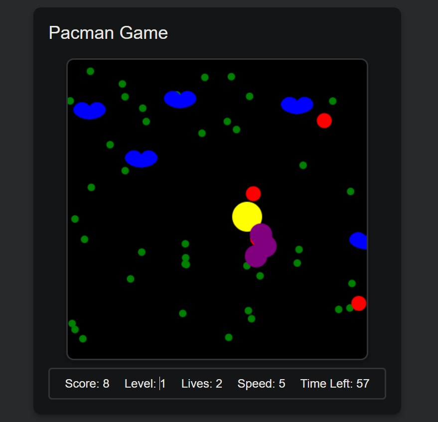
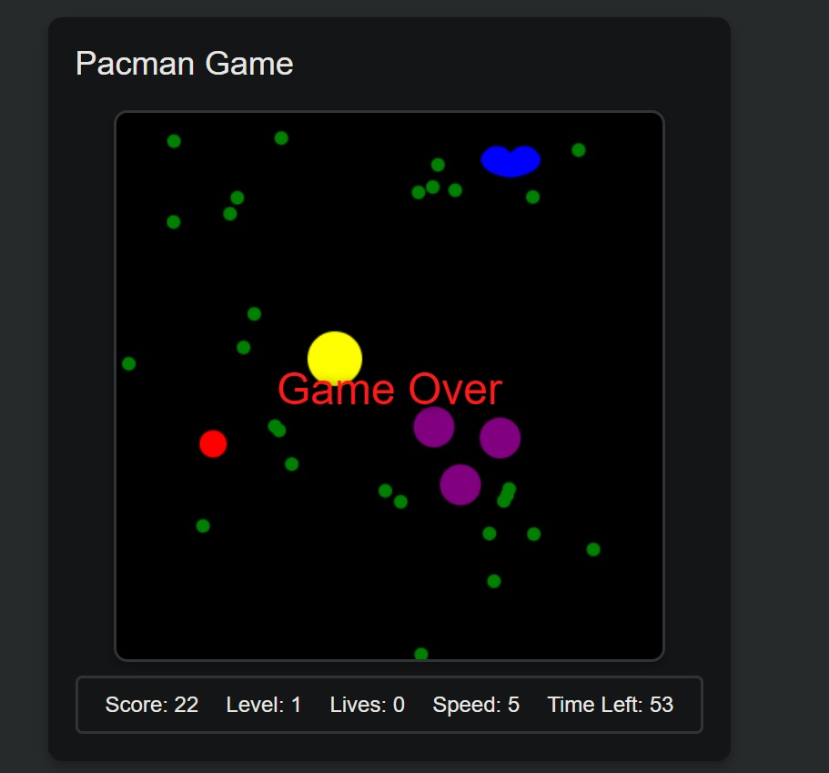

# Min Pacman Game

**Date:** 10/7/2024 **By:** Fadhel.SH  
[Website](#) | [GitHub](https://github.com/Fadhel-SH/min_pacman_game) | [LinkedIn](#) | [Vettery](#)

## Description
A Pacman game developed using HTML, CSS, and JavaScript. The project includes classic gameplay elements, such as pellets, ghosts, bombs, and lives, with an added twist of ghosts changing direction and fleeing upon catching Pac-Man. The game features dynamic levels, increasing speed, and various power-ups. This project was created to demonstrate JavaScript game development skills.

## How to play
To play the game:
1. Open `index.html` in your web browser.
2. Use the arrow keys to move Pac-Man.
3. Press 'P' to pause or resume the game.
4. Press 'R' to restart the game.
5. Avoid ghosts, collect pellets, and enjoy the game!

## Technologies used
- **HTML**
  - index.html
- **CSS**
  - Style.css
  - Game.css
- **JavaScript**
  - min_pacman_game.js

## Screenshots

## Future Updates
- Add new levels with different layouts.
- Implement mobile touch controls.

## Credits
- Game sounds: [pixabay.com](https://pixabay.com/)
- Ghosts and Pac-Man sprites: [codepen.io](https://codepen.io/Teachcode/pen/JjBjVQJ)
- Markdown Guide: [ia.net](https://ia.net/)
- Markdown Cheatsheet: [GitHub](https://github.com/adam-p/markdown-here/wiki/Markdown-Cheatsheet)

## Author
- [Fadhel.SH](https://github.com/Fadhel-SH)
